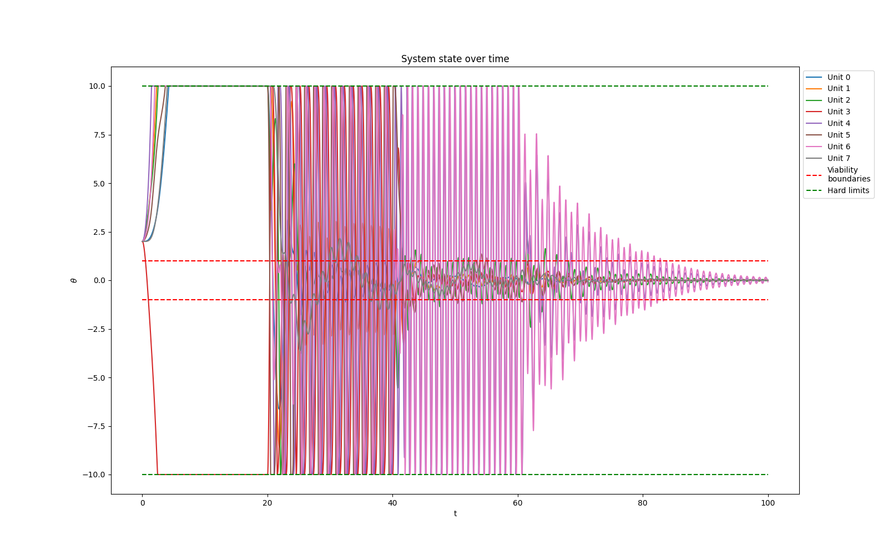
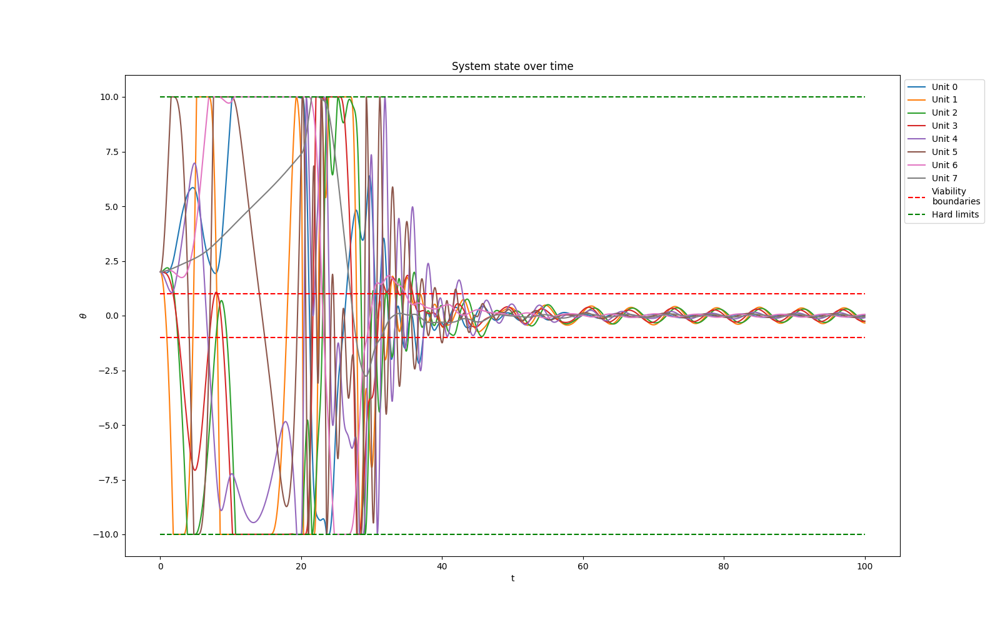

# Homeostat

This project attempts to extend Ashby’s homeostat machine using population-based optimisation methods. The homeostat is an ultra-stable system that is disturbed, and every optimisations made here are an attempt to recreate stability. Overall the experiment tries to scale the number of units in the systems and compares the effectiveness of a genetic algorithm (GA) and particle swarm optimisation (PSO) in finding good solutions. There are two main hypotheses:

1) A genetic algorithm and a particle swarm optimisation algorithm are hypothesised to find solutions for higher numbers of units in the homeostat, compared to a random search method.

2) A PSO is hypothesised to find solutions quicker but should produce more suboptimal solutions than the genetic algorithm.

# Requirements

The requirements are listed in the pyproject.toml file. In addition, the simulation environment Sandbox (Johnson, 2023) is required. It can be found in the Sandbox_V1_2 folder. 

# Discussion

This publication had two main hypotheses. Firstly, population-based optimisation algorithms should outperform random search, and secondly, a PSO should be better suited for the homeostat problem than a genetic algorithm. Both hypotheses could largely be supported with evidence. The GA and the PSO were able to outperform the random search function, and in scaling the unit’s number, the performance of the PSO was able to find good solutions for up to eight fully connected and recurrent units. In the following, these results are discussed, and future research opportunities are established.

## Scaling with a PSO and a GA

The superiority of the PSO over the GA is the main finding of this paper. From the results above, some explanations for this behaviour can be deduced. Firstly, the PSO’s advantage in finding solutions in continuous problem spaces rather than discrete ones seems important. Overall, the PSO’s balance between exploration and exploitation and the continuous incremental updating of the evaluation leads to better results. One explanation could be that the directionality of the PSO is much more beneficial in this situation than the increased stochasticity of the GA. Combining the local search around the previous personal best value and the global search could give the PSO an advantage, especially in this setup with a limited duration of each run. On the other hand, the GA was run for longer and with more adaptation points, producing no stable solutions. Hence, the argument is not as clear-cut as it might appear. It might be a pseudo-advantage that does disappear with longer runtimes, or it might be the result of the genuine superiority of the PSO on this task.

Another explanation could be the structure of the algorithms. Effectively, all solutions in the PSO population are searching for a solution and are updated in each iteration. Whereas in the case of the GA, at each time step, only two solutions are effectively evaluated. Hence, more solutions are updated per iteration, giving the PSO a competitive edge. Future research should replicate the findings from this study and use a GA setup that evaluates more genotypes simultaneously to see whether this suggestion might hold. At the same time, some of the experimental runs in this paper were conducted with more iterations and could not produce promising results. So, this argument is also preliminary at best.

## Oscillating solutions and Suboptimal, semi-viable search solution

The oscillating nature of one of the PSO results and the non-viable but stable solutions have implications for generalising the model. The homeostat is an interesting experiment in and of itself, but it also carries some interesting consequences for ultra-stable systems in general. In the case of the oscillations, the system indicated that not all ultra-stable solutions need to be without changes in the rate of change within the viable bounds of the system. This makes sense when considering the homeostat and ultra-stable systems as an abstraction of more complex natural systems. For example, metabolically, anabolic, and hormonal processes are ultra-stable systems. As such, these systems are not all centred around fixed values but are much more likely to fluctuate with some periodicity. In human sleep, melatonin, for example, is a crucial hormone for healthy sleep. However, the level of melatonin in the body is not a fixed value but fluctuates with the level of blue light and the general circadian rhythm of the body (Xie et al., 2017). The system is perfectly stable and kept within a viable bound, but it is also not static. Being able to replicate these kinds of periodic swings with a simple model like the homeostat is interesting. It might allow for modelling more complex behaviour that follows similar patterns or provide a fundamental understanding of complex phenomena' underlying structures. In the future, fruitful research might be conducted to investigate these fluctuating but stable solutions. Related to this point is the finding that the algorithms could find non-viable but stable solutions in some of the runs. This has some interesting implications for understanding. Aspects of human behaviour. The introduction mentions that mental illnesses such as drug dependence must be considered systemically (Green et al., 2021). Tying this understanding in with the finding in this paper, some forms of stable drug dependence could be understood as stable but sub-optimally viable states. Overall, abstract but small-scale models like the homeostat could provide valuable insight into more complex social and biological systems and help researchers understand the fundamental properties of these systems that apply to both the homeostat and more complex real-world issues.
